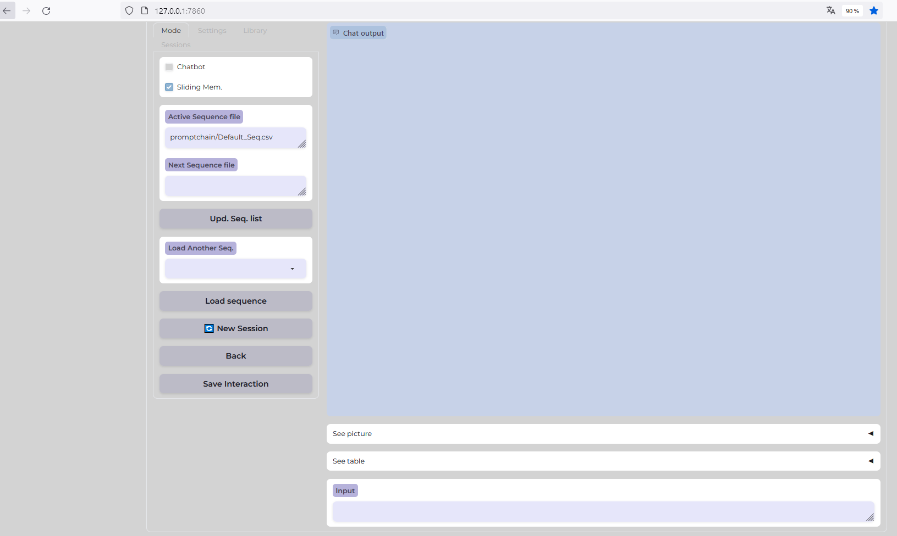
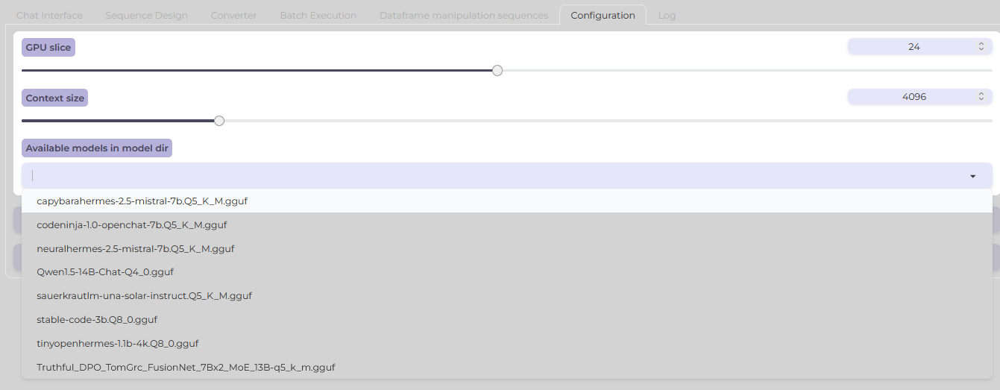
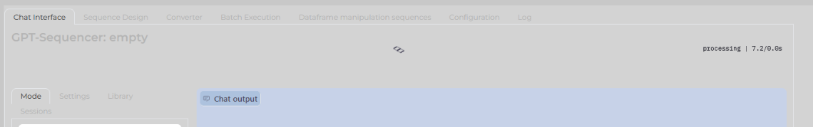

# Chapter 1: Introduction to GPT-Sequencer

Welcome to GPT-Sequencer, an advanced chat interface designed to streamline your interactions by harnessing the capabilities of large language models. In this guide, we'll walk through the process of setting up the application and initiating a simple chat session.

## Step 1: Connect to GPT-Sequencer

Start by connecting to the GPT-Sequencer interface. Open your preferred web browser and navigate to by default [http://127.0.0.1:7860/](http://127.0.0.1:7860/):
 

You should see the main interface, as shown in the image above. This is the starting point for interacting with GPT-Sequencer.

## Step 2: Choose Your Model

Before interacting with the chatbot, you must load a model. Click on the `Configuration` tab and select a model from the dropdown list under 'Available models in model dir'. Choose a model that fits your requirements. If you update the list of available models, it will list all .gguf models present in your /models directory. When your selection is made, click on the "Load Model" button and go the main "Chat Interface" Tab.

## Step 3: Model Loading

After selecting a model, the application will begin loading it. Once the model is loaded, the model name will be mentioned back to the main interface tab, you are ready to chat.

 

## Step 4: Ready to Chat

With the model loaded, the `Chatbot` mode is now active. You'll notice the 'Sliding Memory' feature is enabled by default, which helps in maintaining context during the conversation. The default "roles" are set to "User :" and "Assistant :". You may edit those depending on the model requirements. If you disable the chatbot mode (checkbox), no roles will be appended to the conversation and sliding memory will be disabled, such may suit "Instruction mode" or any other purposes where context is provided expecting one-shot answer.

To start chatting:

1. Enter your query in the `Input` box at the bottom of the interface.
2. Press enter.

The chatbot will process your input and the conversation will appear in the `Chat output` section. At the moment, there's no fancy streaming of text, but answer should appear after some seconds or minutes (depending on your setup and model ). 

## Step 5: Interacting with GPT-Sequencer

After sending your message, wait for the GPT-Sequencer to reply. The response will be displayed in the `Chat output` section, as illustrated below. You can continue the conversation by typing more questions or responses.

# Answer

Congratulations! You've successfully started a session with GPT-Sequencer. Continue exploring the various features and settings to fully utilize the capabilities of this powerful chat interface.

Stay tuned for the next chapters where we will delve deeper into sequence design, batch execution, and other advanced features of GPT-Sequencer.
